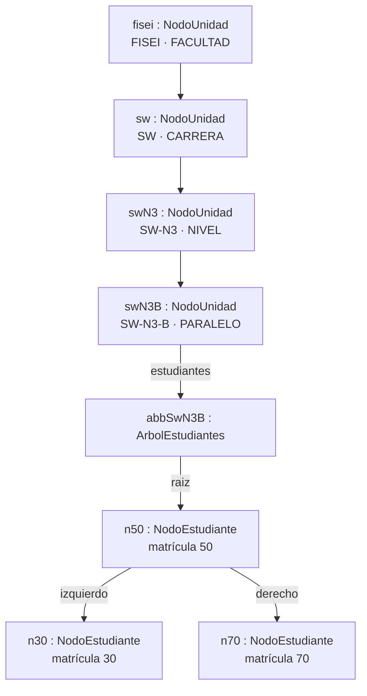

# Diagrama de objetos

Un caso concreto: el paralelo **SW-N3-B** apunta a su ABB de estudiantes. Esa flecha es el atributo `estudiantes` de `NodoUnidad`.

```mermaid
flowchart TD
    fisei["fisei : NodoUnidad<br/>FISEI · FACULTAD"] --> sw["sw : NodoUnidad<br/>SW · CARRERA"]
    sw --> n3["swN3 : NodoUnidad<br/>SW-N3 · NIVEL"]
    n3 --> pb["swN3B : NodoUnidad<br/>SW-N3-B · PARALELO"]
    pb -- estudiantes --> abb["abbSwN3B : ArbolEstudiantes"]
    abb -- raiz --> e50["n50 : NodoEstudiante<br/>matrícula 50"]
    e50 -- izquierdo --> e30["n30 : NodoEstudiante<br/>matrícula 30"]
    e50 -- derecho --> e70["n70 : NodoEstudiante<br/>matrícula 70"]
```
