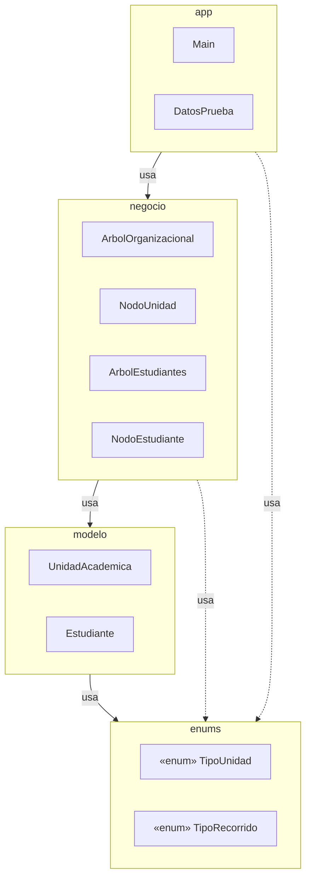

# Diagrama de paquetes

Las dependencias van en un solo sentido: `app → negocio → modelo → enums`. `enums` no depende de nadie; `negocio` y `app` también lo usan directamente.

```mermaid
flowchart TB
    subgraph app["app"]
        Main["Main"]
        DatosPrueba["DatosPrueba"]
    end
    subgraph negocio["negocio"]
        ArbolOrganizacional["ArbolOrganizacional"]
        NodoUnidad["NodoUnidad"]
        ArbolEstudiantes["ArbolEstudiantes"]
        NodoEstudiante["NodoEstudiante"]
    end
    subgraph modelo["modelo"]
        UnidadAcademica["UnidadAcademica"]
        Estudiante["Estudiante"]
    end
    subgraph enums["enums"]
        TipoUnidad["«enum» TipoUnidad"]
        TipoRecorrido["«enum» TipoRecorrido"]
    end
    app -- usa --> negocio
    negocio -- usa --> modelo
    modelo -- usa --> enums
    negocio -. usa .-> enums
    app -. usa .-> enums
```
